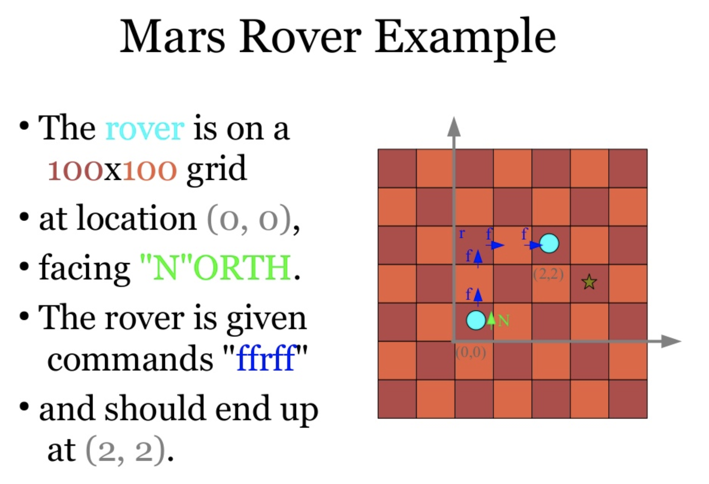

# Mars Rover Kata

You’re part of the team that explores Mars by sending remotely controlled vehicles to the surface of the planet. 

Develop a program that translates the commands sent from earth to instructions that are understood by the rover.

## Your Task  
You are given the initial starting point (x,y) of a rover and the direction (N,S,E,W) it is facing.

The rover receives a character array of commands that should execute.

Possible commands are: 
- Forward `F`
- Backwards `B`
- Left `L`
- Right `R`



## Iterations
Next iterations are a suggestion about how to build the program in increments. 
They include some tips to guide you in case you want. 
Please, feel free on skipping the tips and doing it on your own if you feel brave!
Also, if you have any other proposal, please share, we would love to here and have good conversations :D.

### Iteration 1
Implement command that move the rover forward (`F`).

*Tips*

A way to test this behaviour is to check in which position and direction the rover is after executing the command.

Imagine that the rover is in position `(1, 1)` and direction `Direction.North`. 
If the rover receives the command `F`, its new position would be `(1, 2)` and direction does not change, so `Direction.North`.

The first test could be like this:
```javascript
describe("A rover facing North receives the command Forward", () => {
    const initialPosition = new Position(1, 1);
    const initialDirection = Direction.North;
    const rover = new Rover(initialPosition, initialDirection);

    rover.execute('F');

    it("moves one position up in Y axis", () => {
        expect(rover.position).toEqual(new Position(1, 2));
    });

    it("does not change its direction", () => {
        expect(rover.direction).toBe(Direction.North);
    });
});
```

- Cool!! We have our first test. Well done!! Our rover knows how to move forward facing the North!!!
- Are we ready for the next iteration?
- Wait, wait... what if the rover is facing other directions? 
- With this test, we are testing the logic when the rover is facing North, but what if is facing East?
- We need another test for this, because the new position would be `(2, 1)` facing `E`.

Ok, it seems we need a test for each direction. Look, the structure could be like this:

```javascript
describe("A rover receives the command Forward", () => {
    describe("is facing North", () => {
        it("moves one position up in Y axis", () => { ... });
        it("does not change its direction", () => { ... });
    });
    
    describe("is facing East", () => {
        it("moves one position right in X axis", () => { ... });
        it("does not change its direction", () => { ... });
    });
    
    describe("is facing South", () => {
        it("moves one position down in Y axis", () =>{ ... });
        it("does not change its direction", () => { ... });
    });
    
    describe("is facing West", () => {
        it("moves one position left in X axis", () =>{ ... });
        it("does not change its direction", () => { ... });
    });
});
```
 
- Are tests passing? 
- Awesome!! We are ready for the next iteration.
- It was not that hard, right?
- The really cool thing is that tests are super descriptive, this is our documentation!

### Iteration 2
Implement command that move the rover backwards (`B`).

*Tips*

This is really similar to the previous iteration, right? ;)

### Iteration 3
Implement commands that turn the rover left/right (`L`, `R`).

*Tips*

Oh, this looks similar to previous iterations. What changes? In this case, the direction changes!

### Iteration 4
Implement wrapping from one edge of the grid to another. (planets are spheres after all!)

*Tips*

We are not giving any other tip any more :D, but it seems that if you need to implement that... you would need some boundaries!
And also... have you tried to pass several commands to the rover at once instead of only one? `rover.execute("FFLFRBLFFF")`

### Iteration 5
Implement obstacle detection before each move to a new square. 
If a given sequence of commands encounters an obstacle, the rover moves up to the last possible point, 
aborts the sequence and reports the obstacle.